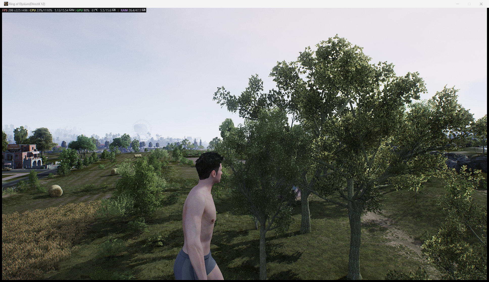

# 无限法则离线研究

[English](README_EN.md)

这是一个正在进行中的个人研究项目，用于探索《无限法则》（Ring of Elysium）原在线服务停止后，离线客户端的本地运行体验与系统恢复方向。

## 当前状态

**预计整体进度：80%**

项目的核心研究里程碑已经达到。目前主要进入优化、回归测试、视觉验证和文档整理阶段。

## 项目截图

## 已完成的里程碑

- 离线大厅与地图进入流程
- 本地 Gameplay 角色初始化
- 原生水平移动
- 原生重力、下落、跳跃与落地
- 地形高度场碰撞
- 水体检测与游泳交互
- 基础海洋波浪与反射动画
- 天气控制与环境系统实验
- 船只生成、上船、下船与移动
- 载具摄像机响应与回归测试
- 游戏内状态与控制界面

## 正在进行

- 独立验证入水时的 splash、ripple 与 foam 视觉效果
- 更长时间的稳定性与重启回归测试
- 将研究笔记整理成持久、清晰的技术历史
- 明确私人实验内容与公开进度文档之间的边界

## 仓库范围

本仓库仅用于公开记录项目进度，不包含游戏可执行文件、游戏资源、编译产物、源代码、内存转储、私人日志、运行时地址或机器相关操作说明。

项目定位为离线、单人研究与数字保存工作，不是在线修改、在线服务或产品发布。

## 文档

- [项目进度](PROGRESS.md) - 当前里程碑表
- [路线图](ROADMAP.md) - 下一阶段研究计划
- [研究日志](RESEARCH_LOG.md) - 项目时间线摘要
- [更新记录](CHANGELOG.md) - 公开进度更新

## 版权说明

《无限法则》及其相关游戏资源归相应权利人所有。本仓库是独立的研究进度记录，与原开发商或发行商没有隶属、合作或官方授权关系。
